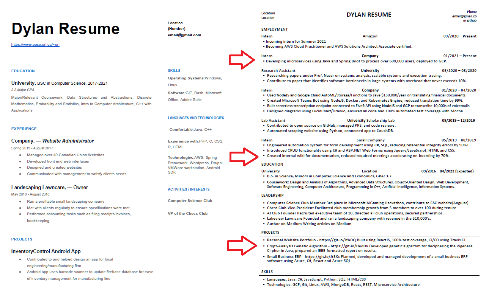

# Dylan's Resume Guide
*Forewarning, this guide is meant to help you get into large companies, and as such this guide is designed for those companies - this means that some things may or may not apply to smaller shops. This does not mean you can't use this guide for these companies as well (I personally did), it just means that the advice may or may not matter for specific companies.*

## Contents
 - [FAQ](#faq) 
 
 - [Resume Guide](#guide)
   - [Recommended Templates/Formats](#format)
   - [Employment Content/Bullet points](#content)
   - [Projects](#projects)
   - [Skills](#skills)
 
 - [LinkedIn Guide](#LinkedIn)
 

    
    

## FAQ

#### Want to skip my guide and use someone elses?

Check out this guide here:

https://www.careercup.com/resume

Check out these succesful people's resumes here:

https://www.careeers.org/resumes

#### Why should you listen to this guide? 

I found my own internships coming from a small, almost non heard of Ontario university. Recently, interviews (realistically, this is what this guide can and will help you get) and offers including Amazon and Microsoft, but previously I had offers and interviews for many other large companies such as RBC/OPG/OMERS/IBM.

#### Okay, but you're not a recruiter, you're just an intern, what do you know about resumes?

I have spoke with many recruiters personally, have had my resume reviewed many times, and attended events like Passport to Google. I've wasted countless hours on /r/cscq and /r/csmajors (for better or worse), and have read many many articles and discussed these topics with other people who have gone on to work at top companies. Hopefully you can read this guide and skip the countless hours I spent and use your time on applying (which is the most important thing, please apply a lot and frequently, and early).

#### What does your resume look like?

Note: probably not up to date

https://www.cosc.brocku.ca/~ds16bz/resume/Dylan_Souvage_Resume.pdf

## Guide

I'm going to try to keep this as succinct as possible:

#### 1) Format

https://www.rezi.io/

https://www.overleaf.com/articles/moharnab-resume/jswvscyqsryt

https://www.overleaf.com/latex/templates/jakes-resume/syzfjbzwjncs

Avoid formats that too dense or too flamboyant, recruiters are sifting through thousands of applications per day, it's best to just keep it standard *(Note, this might not apply to UI/UX or Specific Front End roles)*.

As a student, you want your education at the top(this can include coursework), followed by internships or relevant experience if you have them, followed by projects then anything else you might want to add, ex) volunteering, awards, skills.

If you don't have any internships yet, follow the same formula but put experience below projects and skills and put less priority into it.

One column resumes are the best, 90% of the time, for big companies.

Use .docx or .pdf format only.

#### 2) Content

Everything should be more or less STAR format if possible (might be harder for projects or for education, but pretty much mandatory for employment):
https://en.wikipedia.org/wiki/Situation,_task,_action,_result

On top of STAR format, your results should be data driven.

https://www.washingtonpost.com/business/capitalbusiness/an-inside-look-at-googles-data-driven-job-interview-process/2013/09/03/648ea8b2-14bd-11e3-880b-7503237cc69d_story.html

Each bullet point should use an action verb that ideally hasn't been used yet, see here:
https://www.themuse.com/advice/185-powerful-verbs-that-will-make-your-resume-awesome

EXAMPLE BULLET POINTS:

- Used X technology to solve Y problem resulting in Z achievement.

- Engineered internal transcription middleware connected to Five9 API using NodeJS and GCP to transcribe 10,000s of company voicemails resulting in 1000's of employee hours saved monthly.

#### 3) Projects
This can be anything, if you have no projects that you've done on your own time, include your school projects for example, if you've done no school projects, you're not ready to be applying! I'm talking about anything, even an assignment from your first data structure class or something. These projects do NOT need to be completed 100% working projects, they just need to be something you can talk about with an interviewer. Treat it as if it were a job, how would you write about it? 
EXAMPLE:
- Wrote application using Java that created and could traverse binary search tree using Preorder, Postorder and Inorder traversals
- Designed and deployed personal website to showcase portfolio using React and Github pages.

#### 4) Skills

Literally anything you've ever used and are aware of, stuff you could talk about if required, just be honest up front with your interviewer if they ask you about something that you aren't an expert with on your resume.

# LinkedIn

I am not as qualified to speak on LinkedIn as I believe all my success came from mass applying with a quality resume. However, these are some useful links and resources for anyone looking to upgrade their LinkedIn.

Crowdsourced Photo Review for LinkedIn (Recruiters spend 20% of the time looking at your profile picture, first impressions matter, etc):

https://www.photofeeler.com/my-tests

What You Should Be Doing on LinkedIn Every Month, Week, and Day:

https://www.themuse.com/advice/what-you-should-be-doing-on-linkedin-every-month-week-and-day

4 Elements of a Killer LinkedIn Summary:

https://www.themuse.com/advice/4-key-elements-of-a-killer-linkedin-summary

As some general info, add lots of skills to your profile, try to get endorsed or recommended, get skill verifications, be detailed in your work experience, show results, and add anyone - there is no downside to too many connections. If that makes you feel uncomfortable, free to include notes if you want when you connect.

#### Useful Links

CSCareerQuestions Reddit: https://www.reddit.com/r/cscareerquestions/

CSMajors Reddit: https://www.reddit.com/r/csmajors/

ITCareerQuestions Reddit: https://www.reddit.com/r/ITCareerQuestions/

CSMajors Discord: https://discord.gg/Zukpvz9E47

CSCareerQuestions Discord: https://discord.gg/vq9VjeBWy9

CSCareers Dev Discord: https://discord.gg/CFuGHcmGCk

UWaterloo Discord: https://discord.gg/sAzqcCqS5W
